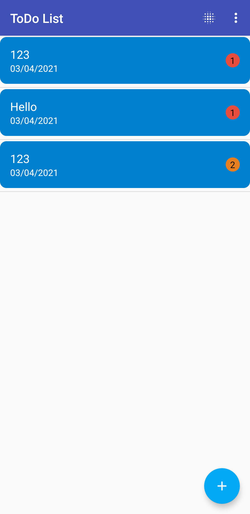

# Todo List

# Validation
 Validation for registration 
  

 
Validation for Login
 

# Register
Creating New User
 

# Login
Logging in using valid credincials
 

# Home Page

# Add Task
After Login user can add task by using add button on the bottom right
 

# Delete Task
By swiping user can delete tasks
 

# Delete All Task
User can delete all the task at once by clicking on the top right and delete all button
 

# Edit Task
User can also edit the tasks
 

# Logout
By clicking on the top right button there is Logout button by clicking that user can exit the task
 

